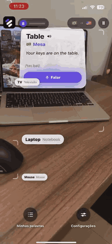
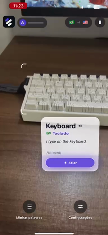
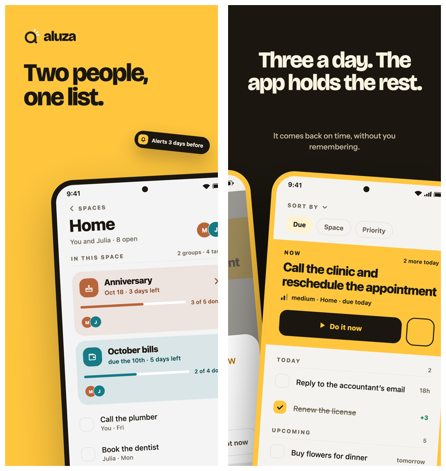
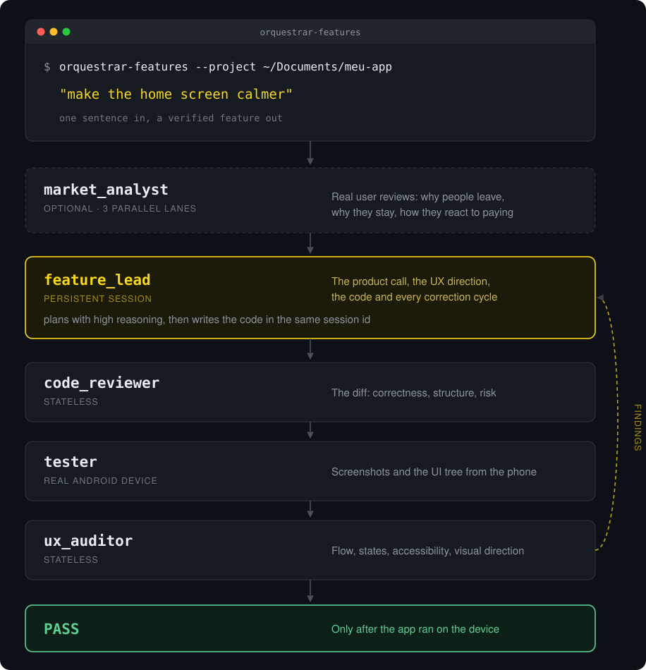
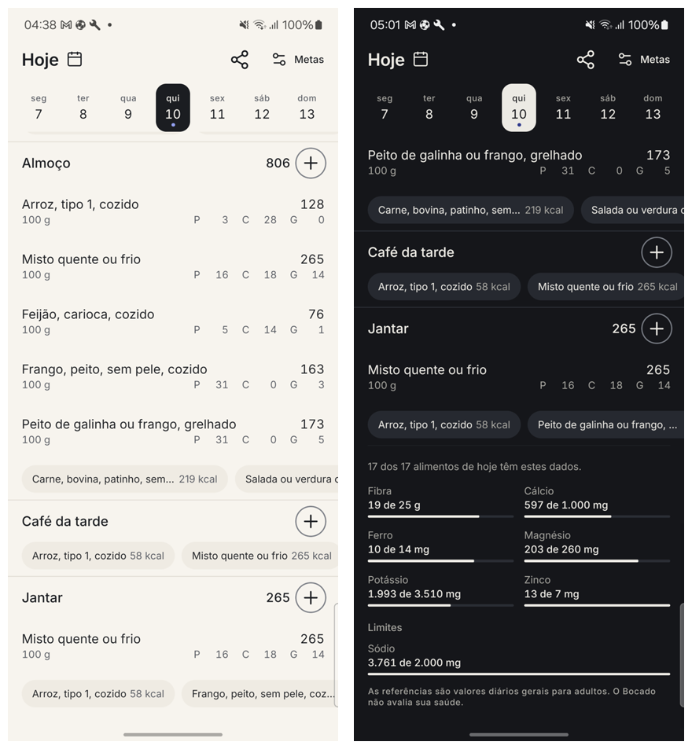

<h1 align="center">Gustavo Emanuel Rosa</h1>

  <b>Mobile Software Engineer</b> · React Native · Android (Kotlin/Java) · iOS (Swift) 
  6 years shipping production apps — including one used by 200,000+ people a day. Now building my own.

  
  
  
  

<h2 align="center">Projects</h2>

  Two apps, an open-source SDK, an agent tool and a library — each with the reason it exists

<table>
<tr>
<td width="50%" valign="top">

### [Lesingo](https://github.com/gustavo-em/lesingo) &nbsp;

Points the camera at everyday objects and anchors an English card over each one — word, translation, IPA and speech. <b>No backend, no frame ever leaves the phone.</b>

`VisionCamera 5` `MediaPipe · EfficientDet-Lite0` `Kotlin (Nitro)` `Reanimated`

[Full video demo](https://github.com/gustavo-em/lesingo#demo) · [Site](https://gustavo-em.github.io/lesingo/) · [Architecture](https://github.com/gustavo-em/lesingo/blob/main/docs/ARCHITECTURE.md)

</td>
<td width="50%" valign="top">

### [Aluza](https://github.com/gustavo-em/aluza) &nbsp;

A shared to-do list that <b>captures without limit and commits to three</b>. The rule lives in the domain layer, not in the UI — `Trio` and `Progress` are types, so a redesign can't break it.

`React Native 0.87` `TypeScript` `Firebase` `Clean Architecture` `MVVM` `offline-first`

[App Store](https://apps.apple.com/us/app/aluza-shared-to-do-list/id6808513680) · [Site](https://ideiasorganizetask.web.app/) · [Architecture](https://github.com/gustavo-em/aluza/blob/main/docs/ARCHITECTURE.md) · [ADRs](https://github.com/gustavo-em/aluza/tree/main/docs/adr)

</td>
</tr>
<tr>
<td width="50%" valign="top">

### [Orchestrator Features](https://github.com/gustavo-em/orchestrator-features)

One sentence goes in. It plans the React Native feature, writes it, <b>opens the app on a real Android device</b>, reads the UI tree — and only then says whether it passed.

`Node ≥18` `Claude Code` `Codex` `Android automation`

[How it works](https://github.com/gustavo-em/orchestrator-features#how-it-works) · [Token economy](https://github.com/gustavo-em/orchestrator-features#token-economy)

</td>
<td width="50%" valign="top">

### [Bocado](https://github.com/gustavo-em/bocado)

A calorie counter that logs Brazilian food in <b>three taps, offline, without an account</b> — the official food tables shipped with the household measures people actually use at the table.

`React Native` `TypeScript` `offline` `pt-BR / en-US`

[Repository](https://github.com/gustavo-em/bocado) · [Why it exists](https://github.com/gustavo-em/bocado#why-it-exists)

</td>
</tr>
<tr>
<td width="50%" valign="top">

### [BigBlueButton Mobile](https://github.com/bigbluebutton/bigbluebutton-mobile)

Open-source SDK for the BigBlueButton classroom platform. I built the <b>React Native + Swift integration for iOS screen sharing</b> over WebRTC, with a team distributed across countries.

`Swift` `React Native` `WebRTC` `Native iOS`

[Repository](https://github.com/bigbluebutton/bigbluebutton-mobile) · [My fork](https://github.com/gustavo-em/bigbluebutton-mobile-tablet)

</td>
<td width="50%" valign="top">

### [react-native-logfile](https://github.com/gustavo-em/react-native-logfile)

Writes, persists and shares application logs straight from a user's device — built because production bugs don't reproduce from a stack trace alone.

`React Native` `TypeScript` `npm`

[npm](https://www.npmjs.com/package/react-native-logfile-share) · [Repository](https://github.com/gustavo-em/react-native-logfile)

</td>
</tr>
</table>

 

  
  <b>Day to day:</b> React Native · TypeScript · Kotlin · Swift · native modules & bridging · SQLite and offline-first sync · Firebase · Clean Architecture · MVVM · performance work on entry-level devices
  

  Most of my professional work lives in private company repositories under my work account <a href="https://github.com/gustavoRosaPontoTel">@gustavoRosaPontoTel</a>.

