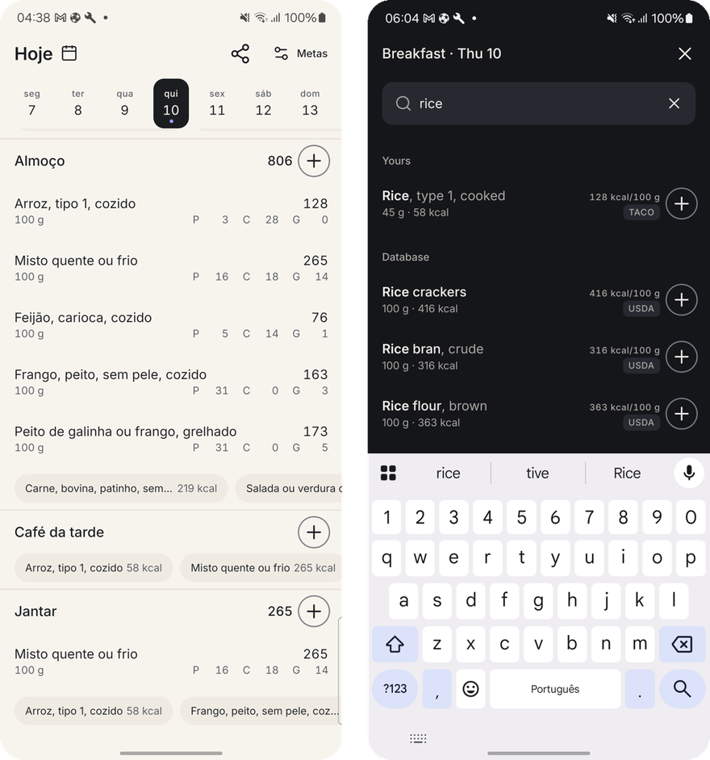
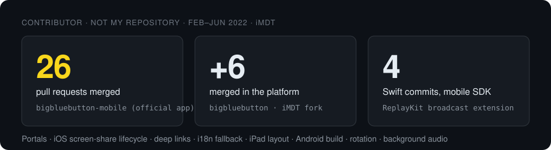
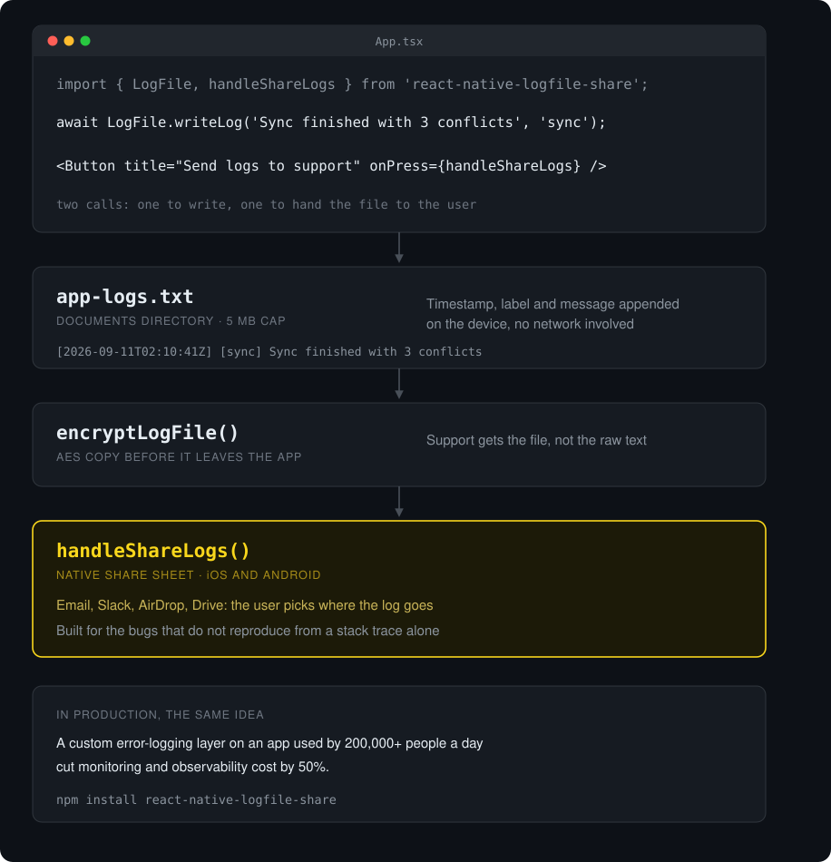

  <b>Mobile Software Engineer</b> · Android (Kotlin) · iOS (Swift) · React Native 
  6 years shipping Android and iOS apps, one of them used by 200,000+ people a day. Open to senior mobile roles (React Native, Android, iOS), remote (US/EU overlap, UTC−3).

  
  
  
  

## Apps I built

<table>
<tr>
<td width="50%" valign="top">

</td>
<td width="50%" valign="top">

### [Lesingo](https://github.com/gustavo-em/lesingo)
 

Point the camera at everyday objects and get an English card over each one: word, translation, IPA, speech. No backend, no frame ever leaves the phone.

The camera pipeline is native: VisionCamera 5 frame processor, MediaPipe EfficientDet-Lite0, a Kotlin module through Nitro, overlays in Reanimated. Tuned to hold its frame rate on an entry-level Galaxy J6.

[Video demo](https://github.com/gustavo-em/lesingo#demo) · [Site](https://gustavo-em.github.io/lesingo/) · [Architecture](https://github.com/gustavo-em/lesingo/blob/main/docs/ARCHITECTURE.md)

</td>
</tr>
<tr>
<td width="50%" valign="top">

</td>
<td width="50%" valign="top">

### [Aluza](https://github.com/gustavo-em/aluza)

A shared to-do list that captures without limit and commits to three. The rule lives in the domain layer, not in the UI, so a redesign cannot break it.

React Native 0.87, TypeScript, Firebase, offline-first, Clean Architecture + MVVM, released through App Store Connect.

[App Store](https://apps.apple.com/us/app/aluza-shared-to-do-list/id6808513680) · [Site](https://ideiasorganizetask.web.app/) · [Architecture](https://github.com/gustavo-em/aluza/blob/main/docs/ARCHITECTURE.md) · [ADRs](https://github.com/gustavo-em/aluza/tree/main/docs/adr)

</td>
</tr>
<tr>
<td width="50%" valign="top">

</td>
<td width="50%" valign="top">

### [Bocado](https://github.com/gustavo-em/bocado)

A calorie counter that logs Brazilian food in three taps, offline, without an account: the official food tables shipped with the household measures people actually use at the table.

Left: Portuguese, light theme. Right: English, dark theme. React Native, TypeScript, SQLite, pt-BR / en-US, in-app theme switch for phones whose system setting is locked.

[Repository](https://github.com/gustavo-em/bocado) · [Why it exists](https://github.com/gustavo-em/bocado#why-it-exists)

</td>
</tr>
</table>

## Open-source contributions

**[BigBlueButton Mobile](https://github.com/bigbluebutton/bigbluebutton-mobile)** is the official app of BigBlueButton, an open-source classroom platform. Between Feb and Jun 2022, at iMDT, I had 26 pull requests merged there: multi-portal management, the iOS delegate that stops screen sharing when the app is closed, i18n fallback for missing locales, iPad full-screen layout, Android build fixes. On the native side, my Swift commits in the mobile SDK cover screen-share rotation in the ReplayKit Broadcast Upload Extension, stopping the extension from the app and background audio keep-alive. Async review with a team spread across countries, in English.

[My 26 merged PRs](https://github.com/bigbluebutton/bigbluebutton-mobile/pulls?q=is%3Apr+author%3Agustavo-em+is%3Amerged) · [Swift commits in the SDK](https://github.com/gustavo-em/bigbluebutton-mobile-sdk/commits?author=gustavo-em) · [PRs in the platform](https://github.com/bigbluebutton/bigbluebutton/pulls?q=is%3Apr+author%3Agustavo-em+is%3Amerged)

## Tools and libraries

<table>
<tr>
<td width="50%" valign="top">

</td>
<td width="50%" valign="top">

### [Orchestrator Features](https://github.com/gustavo-em/orchestrator-features)

One sentence goes in. It plans the React Native feature, writes it, opens the app on a real Android device, reads the UI tree, and only then says whether it passed.

Node 18+, Claude Code, Codex, Android automation over adb. Built to ship my own apps faster without skipping the part where a human would have tapped through the screen.

[How it works](https://github.com/gustavo-em/orchestrator-features#how-it-works) · [Token economy](https://github.com/gustavo-em/orchestrator-features#token-economy)

</td>
</tr>
<tr>
<td width="50%" valign="top">

</td>
<td width="50%" valign="top">

### [react-native-logfile](https://github.com/gustavo-em/react-native-logfile)

Writes, persists and shares application logs straight from the user's device. Two calls: one to write, one to hand the file to the user through the native share sheet.

Published on npm as `react-native-logfile-share`. Same idea I took to production at work, where a custom error-logging layer cut monitoring cost by 50%.

[npm](https://www.npmjs.com/package/react-native-logfile-share) · [Repository](https://github.com/gustavo-em/react-native-logfile)

</td>
</tr>
</table>

  <b>Day to day:</b> Kotlin · Swift · React Native · TypeScript · native modules (bridging & Nitro) · SQLite and offline-first sync · Firebase · CI/CD and store releases (Google Play, App Store) · Clean Architecture · MVVM · performance work on entry-level devices

  Most of my professional work lives in private company repositories under my work account <a href="https://github.com/gustavoRosaPontoTel">@gustavoRosaPontoTel</a>. Reach me on <a href="https://www.linkedin.com/in/gustavoemanuelrosa/">LinkedIn</a> or at gustavo.emanuel01@outlook.com, replies within a day, UTC−3.

